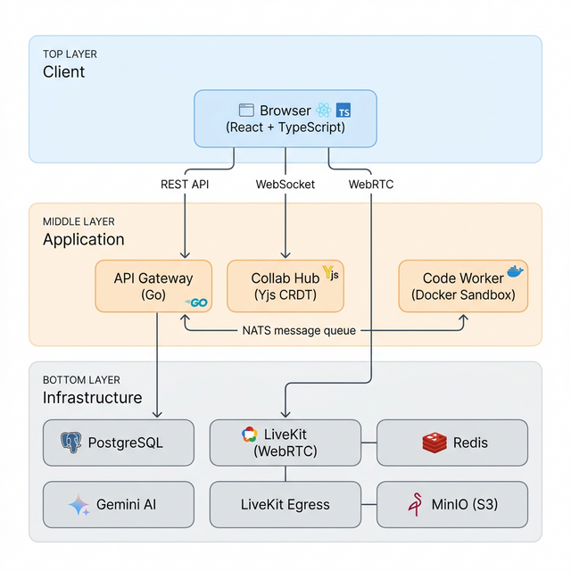

# TalentCurate HQ

### Curate the best talent with intelligent interviews

*Real-time collaborative coding, live video, AI-powered analysis, and adaptive interview rooms — all self-hosted.*

---

**Technical Interviews** · **Behavioral Interviews** · **System Design** · **HR Screens**


## What Is TalentCurate?

TalentCurate is a full-stack interview platform built from the ground up to handle **every type of interview** — not just coding challenges. It combines a real-time collaborative code editor, live video conferencing, sandboxed code execution, AI-driven candidate analysis, and an adaptive interview room that reshapes itself based on the interview format.

Unlike platforms that bolt on video calls to a code editor and call it a day, TalentCurate treats the interview as a **first-class workflow** — from scheduling and interviewer assignment, through the live session, to structured feedback and post-interview AI analysis.

## How Is This Different?

Most interview platforms (HackerRank, CoderPad, Karat) are **coding-first tools** that shoehorn all interviews into a code editor paradigm. TalentCurate is different in several ways:

| | **Traditional Platforms** | **TalentCurate** |
|---|---|---|
| **Interview Types** | Coding only. Behavioral = "just use Zoom" | Adaptive rooms: coding, behavioral, system design, HR — each with tailored UI |
| **Code Execution** | Cloud sandboxes with cold starts | Docker-based sandboxed execution with pre-warmed containers, zero cold start |
| **Collaboration** | One-way or turn-based editing | Real-time CRDT sync (Yjs) — both participants edit simultaneously, Google Docs–style |
| **Video** | External integrations (Zoom/Teams links) | Embedded LiveKit video with automatic session recording to MinIO |
| **AI Analysis** | Post-interview or none | Real-time per-question AI analysis via Gemini during the interview + full session summary |
| **Hosting** | SaaS only, your data on their servers | Fully self-hosted via Docker Compose — your infrastructure, your data |
| **Feedback** | Simple pass/fail or free text | Structured 8-dimension rubric (4 technical + 4 behavioral) with hire recommendation |
| **Scheduling** | Separate tool (Calendly, etc.) | Built-in calendar with multi-interviewer assignment, conflict detection, and interview prep pages |
| **Question Management** | Flat question bank | Typed question library (coding / behavioral / open-ended) with interview templates and interviewer-driven prep |

### The Core USP

> **One platform that adapts to the interview, not the other way around.**
> 
> When an interviewer joins a behavioral session, the code editor disappears and a STAR-method notes panel takes its place. The feedback rubric switches from "Algorithms & Code Quality" to "Leadership & Culture Fit." The system doesn't just *support* non-technical interviews — it's *designed* for them.

## Architecture



| Flow | Path |
|---|---|
| **Live Coding** | Browser → WebSocket → Yjs CRDT sync → all participants |
| **Code Execution** | API Gateway → NATS → Worker (Docker) → NATS → WebSocket → Browser |
| **Video** | Browser ↔ LiveKit (WebRTC peer-to-peer) |
| **Recording** | LiveKit → Egress → MinIO (S3) |
| **AI Analysis** | API Gateway → Gemini API → stored in PostgreSQL |

### Services

| Service | Purpose |
|---|---|
| **API Gateway** | Go HTTP server — session management, auth, questions, feedback, AI analysis |
| **Worker** | Receives code execution jobs via NATS, runs them in isolated Docker containers |
| **Frontend** | React/TypeScript SPA served via Nginx |
| **PostgreSQL** | Persistent storage for sessions, users, questions, templates, feedback |
| **NATS** | Message queue connecting API Gateway ↔ Worker for async code execution |
| **LiveKit** | WebRTC video conferencing server for embedded live video |
| **LiveKit Egress** | Automatic session recording |
| **Redis** | LiveKit's backing store |
| **MinIO** | S3-compatible object storage for session recordings |

## Features

### 🎯 Adaptive Interview Room

The interview room dynamically reconfigures based on the interview type:

- **Technical**: Collaborative code editor (Monaco/Yjs CRDT) + output terminal + video sidebar
- **Behavioral/HR**: Full-width notes panel with STAR method prompts, no code editor
- **System Design**: Auto-opens collaborative whiteboard

### 💻 Sandboxed Code Execution

Code runs in isolated Docker containers with:
- Pre-warmed containers for instant execution (no cold starts)
- Language support: Python, JavaScript, Go, C++
- Timeout protection and resource limits
- Results streamed back via WebSocket in real-time

### 🤖 AI-Powered Analysis

- **Per-question analysis**: Gemini evaluates each code submission during the interview
- **Session-level summary**: Full AI-generated interview summary combining code analysis, communication assessment, and technical depth
- **Interviewer prep pages**: AI-assisted preparation before interviews begin

### 📹 Embedded Video + Recording

- LiveKit-powered WebRTC video built into the interview room
- Automatic session recording via LiveKit Egress
- Recordings stored in MinIO with presigned download URLs

### 📊 Structured Feedback

8-dimension scoring rubric that adapts to interview type:

| Technical Interviews | Behavioral Interviews |
|---|---|
| Algorithms & Data Structures | Leadership |
| Code Quality | Problem Solving |
| Communication | Culture Fit |
| System Design | Domain Knowledge |

Plus free-form feedback, hire/no-hire recommendation, and interview notes.

### 📅 Calendar & Scheduling

- Visual calendar with month/week/day views
- Multi-interviewer assignment per session
- Conflict detection across interviewers
- Candidate email notifications with join links
- Interview prep pages linked from calendar events

### 📝 Question Library & Templates

- Typed questions: Coding, Behavioral, Open-ended
- Interview templates grouping multiple questions
- Interviewer-driven question prep — interviewers choose their own templates
- Conditional form fields (code editor fields hidden for non-coding questions)

### 🔐 Authentication

- Email/password authentication with JWT tokens
- Role-based access: HR, Interviewer, Admin
- Guest access for candidates via session join links (no account required)

## Quick Start

### Prerequisites

- Docker & Docker Compose
- A [Gemini API key](https://aistudio.google.com/apikey) (for AI analysis features)

### Run

```bash
# Clone the repository
git clone https://github.com/dhawalhost/talentcurate.git
cd interview-system

# Set your Gemini API key (and optionally customize admin credentials)
echo "GEMINI_API_KEY=your_key_here" > .env

# Optional: override default admin credentials
# echo "ADMIN_EMAIL=your-admin@company.com" >> .env
# echo "ADMIN_PASSWORD=your_secure_password" >> .env

# Start everything
docker compose up --build -d
```

The platform will be available at:

| Service | URL |
|---|---|
| **Frontend** | http://localhost:8085 |
| **API** | http://localhost:8080/api/v1 |
| **LiveKit** | http://localhost:7880 |
| **MinIO Console** | http://localhost:9001 |
| **NATS Monitor** | http://localhost:8222 |

### Bootstrap Admin

On first startup, one admin account is seeded. Override via `.env` or `docker-compose.yml`:

| Env Var | Default | Description |
|---|---|---|
| `ADMIN_EMAIL` | admin@talentcurate.com | Admin login email |
| `ADMIN_PASSWORD` | admin123 | Admin login password |
| `ADMIN_NAME` | System Admin | Display name |

> **After first login**, use the **Admin Dashboard** (`/admin`) to create HR users, interviewers, and additional admins — each with their own email and password.

### Development

For frontend development with hot reload:

```bash
cd frontend
npm install
npm run dev    # Starts Vite dev server on :5173
```

## Tech Stack

| Layer | Technology |
|---|---|
| **Backend** | Go 1.25, Gorilla Mux, JWT, pgx |
| **Frontend** | React 18, TypeScript, Vite, Framer Motion |
| **Real-time** | WebSocket, Yjs (CRDT), LiveKit (WebRTC) |
| **Code Execution** | Docker-in-Docker sandboxing |
| **Message Queue** | NATS JetStream |
| **Database** | PostgreSQL 15 |
| **Storage** | MinIO (S3-compatible) |
| **AI** | Google Gemini API |
| **Deployment** | Docker Compose (self-hosted) |

## Project Structure

```
interview-system/
├── cmd/
│   ├── api/              # API Gateway entrypoint
│   └── worker/           # Code execution worker entrypoint
├── internal/
│   ├── auth/             # JWT authentication & user registration
│   ├── collaboration/    # WebSocket hub + Yjs CRDT sync
│   ├── db/               # PostgreSQL schema & migrations
│   ├── execution/        # Execution request/result models
│   ├── gateway/          # HTTP server, routing, middleware
│   ├── notify/           # Email notifications
│   ├── question/         # Question CRUD + filtering
│   ├── session/          # Session lifecycle, feedback, AI analysis, recording
│   └── user/             # User management
├── pkg/
│   ├── queue/            # NATS message queue abstraction
│   └── sandbox/          # Docker sandbox executor
├── frontend/
│   └── src/
│       ├── components/   # EditorWorkspace, VideoSidebar, ChatPanel, etc.
│       ├── lib/          # API client, WebSocket service
│       └── pages/        # InterviewRoom, Dashboard, Calendar, PrepPage
├── docker-compose.yml
├── livekit.yaml          # LiveKit server config
└── egress.yaml           # LiveKit Egress recording config
```

## License

Proprietary. All rights reserved.

---

**Built by [TalentCurate](https://talentcurate.com)**
